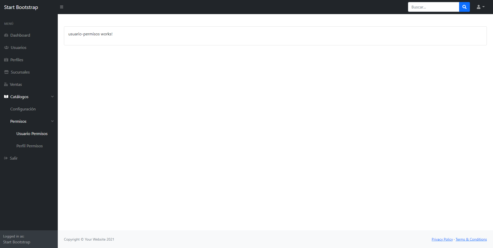

<style>
body {
  font-family: Helvetica, arial, sans-serif;
  font-size: 14px;
  line-height: 1.6;
  padding-top: 10px;
  padding-bottom: 10px;
  background-color: white;
  padding: 30px;
  color: #333;
}

body > *:first-child {
  margin-top: 0 !important;
}

body > *:last-child {
  margin-bottom: 0 !important;
}

a {
  color: #4183C4;
  text-decoration: none;
}

a.absent {
  color: #cc0000;
}

a.anchor {
  display: block;
  padding-left: 30px;
  margin-left: -30px;
  cursor: pointer;
  position: absolute;
  top: 0;
  left: 0;
  bottom: 0;
}

h1, h2, h3, h4, h5, h6 {
  margin: 20px 0 10px;
  padding: 0;
  font-weight: bold;
  -webkit-font-smoothing: antialiased;
  cursor: text;
  position: relative;
}

h2:first-child, h1:first-child, h1:first-child + h2, h3:first-child, h4:first-child, h5:first-child, h6:first-child {
  margin-top: 0;
  padding-top: 0;
}

h1:hover a.anchor, h2:hover a.anchor, h3:hover a.anchor, h4:hover a.anchor, h5:hover a.anchor, h6:hover a.anchor {
  text-decoration: none;
}

h1 tt, h1 code {
  font-size: inherit;
}

h2 tt, h2 code {
  font-size: inherit;
}

h3 tt, h3 code {
  font-size: inherit;
}

h4 tt, h4 code {
  font-size: inherit;
}

h5 tt, h5 code {
  font-size: inherit;
}

h6 tt, h6 code {
  font-size: inherit;
}

h1 {
  font-size: 28px;
  color: black;
}

h2 {
  font-size: 24px;
  border-bottom: 1px solid #cccccc;
  color: black;
}

h3 {
  font-size: 18px;
}

h4 {
  font-size: 16px;
}

h5 {
  font-size: 14px;
}

h6 {
  color: #777777;
  font-size: 14px;
}

p, blockquote, ul, ol, dl, li, table, pre {
  margin: 15px 0;
}

hr {
  border: 0 none;
  color: #cccccc;
  height: 4px;
  padding: 0;
}

body > h2:first-child {
  margin-top: 0;
  padding-top: 0;
}

body > h1:first-child {
  margin-top: 0;
  padding-top: 0;
}

body > h1:first-child + h2 {
  margin-top: 0;
  padding-top: 0;
}

body > h3:first-child, body > h4:first-child, body > h5:first-child, body > h6:first-child {
  margin-top: 0;
  padding-top: 0;
}

a:first-child h1, a:first-child h2, a:first-child h3, a:first-child h4, a:first-child h5, a:first-child h6 {
  margin-top: 0;
  padding-top: 0;
}

h1 p, h2 p, h3 p, h4 p, h5 p, h6 p {
  margin-top: 0;
}

li p.first {
  display: inline-block;
}

ul, ol {
  padding-left: 30px;
}

ul :first-child, ol :first-child {
  margin-top: 0;
}

ul :last-child, ol :last-child {
  margin-bottom: 0;
}

dl {
  padding: 0;
}

dl dt {
  font-size: 14px;
  font-weight: bold;
  font-style: italic;
  padding: 0;
  margin: 15px 0 5px;
}

dl dt:first-child {
  padding: 0;
}

dl dt > :first-child {
  margin-top: 0;
}

dl dt > :last-child {
  margin-bottom: 0;
}

dl dd {
  margin: 0 0 15px;
  padding: 0 15px;
}

dl dd > :first-child {
  margin-top: 0;
}

dl dd > :last-child {
  margin-bottom: 0;
}

blockquote {
  border-left: 4px solid #dddddd;
  padding: 0 15px;
  color: #777777;
}

blockquote > :first-child {
  margin-top: 0;
}

blockquote > :last-child {
  margin-bottom: 0;
}

table {
  padding: 0;
}
table tr {
  border-top: 1px solid #cccccc;
  background-color: white;
  margin: 0;
  padding: 0;
}

table tr:nth-child(2n) {
  background-color: #f8f8f8;
}

table tr th {
  font-weight: bold;
  border: 1px solid #cccccc;
  text-align: left;
  margin: 0;
  padding: 6px 13px;
}

table tr td {
  border: 1px solid #cccccc;
  text-align: left;
  margin: 0;
  padding: 6px 13px;
}

table tr th :first-child, table tr td :first-child {
  margin-top: 0;
}

table tr th :last-child, table tr td :last-child {
  margin-bottom: 0;
}

img {
  max-width: 100%;
}

span.frame {
  display: block;
  overflow: hidden;
}

span.frame > span {
  border: 1px solid #dddddd;
  display: block;
  float: left;
  overflow: hidden;
  margin: 13px 0 0;
  padding: 7px;
  width: auto;
}

span.frame span img {
  display: block;
  float: left;
}

span.frame span span {
  clear: both;
  color: #333333;
  display: block;
  padding: 5px 0 0;
}

span.align-center {
  display: block;
  overflow: hidden;
  clear: both;
}

span.align-center > span {
  display: block;
  overflow: hidden;
  margin: 13px auto 0;
  text-align: center;
}

span.align-center span img {
  margin: 0 auto;
  text-align: center;
}

span.align-right {
  display: block;
  overflow: hidden;
  clear: both;
}

span.align-right > span {
  display: block;
  overflow: hidden;
  margin: 13px 0 0;
  text-align: right;
}

span.align-right span img {
  margin: 0;
  text-align: right;
}

span.float-left {
  display: block;
  margin-right: 13px;
  overflow: hidden;
  float: left;
}

span.float-left span {
  margin: 13px 0 0;
}

span.float-right {
  display: block;
  margin-left: 13px;
  overflow: hidden;
  float: right;
}

span.float-right > span {
  display: block;
  overflow: hidden;
  margin: 13px auto 0;
  text-align: right;
}

code, tt {
  margin: 0 2px;
  padding: 0 5px;
  white-space: nowrap;
  border: 1px solid #eaeaea;
  background-color: #f8f8f8;
  border-radius: 3px;
}

pre code {
  margin: 0;
  padding: 0;
  white-space: pre;
  border: none;
  background: transparent;
}

.highlight pre {
  background-color: #f8f8f8;
  border: 1px solid #cccccc;
  font-size: 13px;
  line-height: 19px;
  overflow: auto;
  padding: 6px 10px;
  border-radius: 3px;
}

pre {
  background-color: #f8f8f8;
  border: 1px solid #cccccc;
  font-size: 13px;
  line-height: 19px;
  overflow: auto;
  padding: 6px 10px;
  border-radius: 3px;
}

pre code, pre tt {
  background-color: transparent;
  border: none;
}
</style>

<p align="center">
 
 <h2 align="center">app-practices-small-projects</h2>
 <p align="center"> Estructura de directorios para pequeños proyectos.</p>
</p>
  <p align="center">
     <a href="https://github.com/magranadosb/app-practices-small-projects/graphs/contributors">
      
     </a>
     <a href="https://github.com/magranadosb/app-practices-small-projects/issues">
      
     </a>
     <a href="https://github.com/magranadosb/app-practices-small-projects/blob/main/LICENSE.md">
      
     </a>
     <a href="https://github.com/magranadosb/app-practices-small-projects/pulls">
      
     </a>
</p> 
<p align="center">
    <a href="https://stackblitz.com/github/magranadosb/app-practices-small-projects">Ver demo</a>
</p>
<br/>
<br/>
<br/>
<br/>

## Tabla de contenidos

<details open="open">
  <summary>Menú</summary>
  <ol>
    <li><a href="#sobre-el-proyecto">🗂️ Sobre el proyecto</a></li>
    <li><a href="#construido-con">🛠️ Construido con</a></li>
    <li><a href="#temas-abordados">📚 Temas abordados</a></li>
    <li>
      <a href="#comenzando">🚀 Comenzando</a>
      <ul>
        <li><a href="#pre-requisitos">📋 Pre-requisitos</a></li>
        <li><a href="#instalación">🔧 Instalación</a></li>
      </ul>
    </li>
    <li><a href="#despliegue">📦 Despliegue</a></li>
    <li><a href="#versionado">📌 Versionado</a></li>
    <li><a href="#contribuidores">✒️ Contribuidores</a></li>
    <li><a href="#licencia">📄 Licencia</a></li>
  </ol>
</details>

## Sobre el proyecto

&nbsp;

&nbsp;
 >Estructura de directorios para medianos y grandes proyectos.

## Construido con

* [Angular CLI v12.0.0](https://angular.io/)
* [Start Bootstrap - SB Admin](https://github.com/startbootstrap/startbootstrap-sb-admin)

## Temas abordados

* Rutas
* RouterLink
* RouterLinkActive
* Lazy-loading

## Comenzando

_Estas instrucciones te permitirán obtener una copia del proyecto en funcionamiento en tu máquina local para propósitos de desarrollo y pruebas._

### Pre-requisitos

* [NodeJS](https://nodejs.org/en/)
* [Git](https://git-scm.com)
* [TypeScript](https://www.typescriptlang.org/download)
  ```sh
  npm install -g typescript
  ```
* [Angular CLI](https://angular.io/cli)
  ```sh
  npm install -g @angular/cli
  ```

### Instalación

_Clonar el repositorio._
```sh
git clone https://github.com/magranadosb/app-practices-small-projects.git
```

_Instalar paquetes de NPM._

```sh
npm install
```
## Despliegue

```sh
ng serve -o
```

## Versionado

Se usa [SemVer](http://semver.org/) para el versionado. Para todas las versiones disponibles, mira los [tags en este repositorio](https://github.com/magranadosb/app-practices-small-projects/tags).

## Contribuidores
&nbsp;

<table>
  <tr>
    <td align="center">
      <a href="https://github.com/magranadosb">
        <br>
        <sub>
          <b>magranadosb</b>
        </sub>
      </a>
    </td>
    <td align="center">

  

  </td>
  </tr>
</table>
&nbsp;

_También puedes mirar la lista de todos los [contribuyentes](https://github.com/magranadosb/app-practices-small-projects/graphs/contributors) quíenes han participado en este proyecto._

## Licencia

Este proyecto está bajo la Licencia MIT - mira el archivo [LICENSE.md](LICENSE.md) para más detalles.
